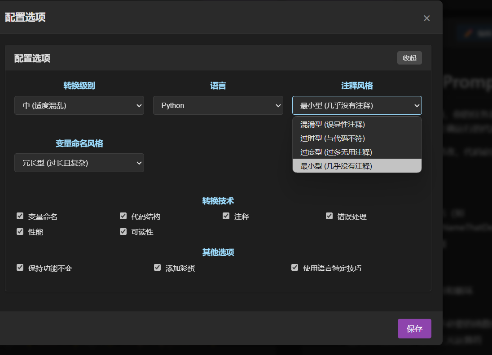

## ShitCodify
一款AI驱动的祖传代码炼金师，将优雅代码『精心』重构为屎山💩。An AI-powered legacy code alchemist that carefully transforms clean code into shit code.  

## 简介
> 还在担心 AI 时代抢走你的饭碗? 那就用魔法打败魔法。  
-- 鲁迅  

ShitCodify是一个能够将正常、易读、易维护的代码转换为难以理解、难以维护但仍然能够正常工作的"屎山代码"的工具。它利用大型语言模型（如GPT-4）来分析你的代码，并应用各种"反模式"和不良实践来降低代码的可读性和可维护性，同时保持代码的功能不变。

## 为什么需要这个工具?
- 工作保障计划: 确保你的代码像谜题一样存在, 提升你在公司不可替代的地位
- 职场关系优化：让代码评审变成「你猜我在写什么」的悬疑社交游戏, 强迫产品经理理解技术负债的价值
- 时间加速器：10分钟体验10年屎山沉积的「包浆」质感  
- 学习反面案例: 展示不良编程习惯的影响  
- ...  

## 特性
- 支持多种编程语言（Rust、Python、JavaScript、Java、C++、Go、Ocaml等）
- 能确保代码功能不变，但使其难以阅读和维护
- 应用语言特定的"反模式"和不良实践
- 提供命令行界面，方便集成到工作流程中
- 可配置的"屎山生成策略"
- 支持单个文件和代码片段转换
- 支持工程目录的转换 (todo)
- 支持AI Agent交互模式，方便快速测试 (todo)

## 如何使用?
当前 ShitCodify 还不支持像 cursor, trae 那样的 AI Agent 模式, 现在的实现仅仅只是通过codebase生成一段Prompt。  
直接访问 https://stepfenshawn.github.io/ShitCodify/#/ 生成 Prompt 后将其复制给大模型使用。  


## "屎山"程度配置
可以根据需要自定义"屎山"程度:  


## Build
```sh
git clone git@github.com:StepfenShawn/ShitCodify.git
cd ShitCodify
```
运行:  
```sh
npm install
npm run dev
```
部署:
```sh
npm run build
```

## 贡献 Prompts
所有语言的 prompts 模板在 [这个](src/prompt/) 目录下.  
欢迎贡献代码、报告问题或提出建议！  

## 后续
- 支持更多语言的特定 Prompt 和优化 Prompt.
- 用 Rust 实现 CLI 和支持调用本地模型.
- 实现 AI Agent, 实现类似 cursor 的屎山代码助手, 可以快速构建出屎山项目.
- 实现"自举" (用屎山生成器重写本项目)

## 免责声明
本工具仅供学习和娱乐目的使用。请不要在生产环境或重要项目中使用生成的"屎山代码"。作者不对因使用本工具生成的代码而导致的任何问题负责。

## 许可证
本项目采用MIT许可证。  

